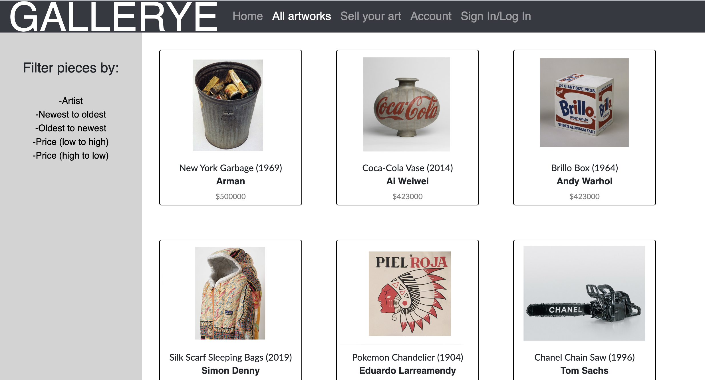

# Gallerye

Problem:

Many a gallery site (e.g. Sotheby’s, Christie’s) are made for the artists that have already made it. Even the smaller galleries that may not be as prominent hold artists, and their works, of which they have already selected to represent. Creating art is both free and freeing, so why not allow any and every artist the opportunity to present, market, manage themselves as a professional. 

Solution:

Gallerye is an open-source E-commerce art site that allows users to buy, sell, bid on artworks directly sourced from individual artists. It represents a virtual gallery that has infinite capacity and the ability for each artist to represent themselves as a professional in the creative market.

Utilization:

Gallerye was created with the average creative in mind, a virtual gallery to present, buy and sell/auction art.

The Future:

* Ensuring that sign-in/login/logout works (as “when connected” / “when not connected”)
* Allow for auction and bids on the site instead of flat-out buys
* Allow artists to upload image files from their computer instead of providing a URL/image address (may need S3 bucket?)
* Set up a messaging tool for user to user interaction
* Paypal/Shopify or other E-commerce platform for payment
* Potential stock price for individual pieces and artists (Stock X influenced???)

